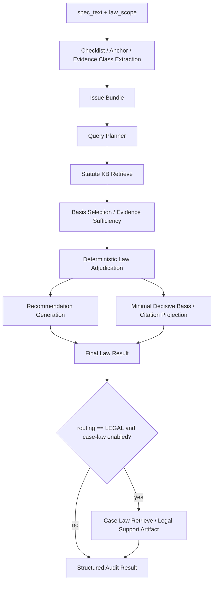

# AI/RAG Design

## Design Goal

The AI design keeps the LLM from becoming the sole authority. The system decomposes compliance triage into checklist extraction, law-scoped retrieval, basis selection, deterministic adjudication, recommendation generation, citation projection, and Human-in-the-Loop handoff.

The key design choice is that the LLM assists the review but does not become the sole decision maker. Retrieval, deterministic rules, structured outputs, and human approval all constrain the workflow.

## Statute-First Grounding

Statutory and regulatory text is the primary evidence lane. The statute KB contains 347 statute chunks across BIPA, CIPA, and VPPA in the inspected runtime asset. Retrieval filters by law key, document type, and unrepealed status, so a VPPA row does not casually borrow CIPA evidence and a BIPA row does not become a generic privacy search.

Case-law support is separate. The inspected runtime asset contains a case-holding lane, but default validation and the standard deploy profile keep case-law disabled. When enabled, case-law retrieval is conditional support for Legal review, not a replacement for statute grounding.

## Pipeline Stages

| Stage | Implementation evidence | Purpose |
| --- | --- | --- |
| Checklist and anchor extraction | `identify_issues_for_law.py`, checklist assets, and issue-packaging modules | Convert spec text into law-specific issue states, evidence classes, and anchor terms. |
| Query planning | `analysis/query_planner.py` | Build concise statute retrieval queries from issue flags, legal terms, section hints, and fallback terms. |
| Statute retrieval | `bedrock/kb.py`, `retrieve_statute_evidence_for_law.py` | Retrieve law-scoped statute chunks through Bedrock KB or local/replay paths. |
| Basis selection | `analysis/rev23_adjudication.py` and retrieval post-processing | Select decisive sections and track sufficiency. |
| Deterministic adjudication | `determine_verdict_for_law.py`, `analysis/verdicts.py`, routing policy assets | Derive outcome and route from issue states, evidence quality, and recommendation mappings. |
| Recommendation generation | `analysis/recommendations.py` | Attach remediation-oriented actions to evidence-backed findings. |
| Citation projection | `citation_projection.py` and finalization modules | Keep output citations minimal and tied to decisive basis sections. |
| Conditional case-law support | `retrieve_caselaw_for_legal_review.py` | Add legal support references only when the route and run mode allow it. |
| Exact prompt cache | `bedrock/llm.py` and prompt cache stack | Reuse exact request envelopes to control cost and replay behavior. |

## Evidence Sufficiency And Conservative Routing

The inspected `apply_guardrails` logic downgrades a would-be `CLEARED` outcome when evidence is weak or mixed. That is a central responsible-AI behavior: the system should ask for review when its support is not strong enough, rather than overclaiming clearance.

Routing is determined from recommendation type, law-specific overrides, and routing policies. `LEGAL_REVIEW` maps to Legal routing, while engineering and policy remediation items map to DEV or POLICY where configured. This preserves the external labels while keeping escalation logic explainable.

## Why Deterministic Adjudication Matters

Pure prompt-only RAG systems often conflate retrieval, reasoning, and final routing into one opaque answer. This PoC keeps the stages inspectable: the LLM can help with structured extraction or query planning, but deterministic rules and evidence contracts decide the final workflow posture. That makes regression testing and release gating practical.

## Prompt And Cache Boundary

The application cache is exact-contract caching, not semantic similarity. Cache keys are derived from normalized request envelopes, model settings, schema/tool contract, and semantic context. This supports reproducibility and cost control without pretending that similar prompts are equivalent.

## Failure Modes And Mitigations

| Failure mode | Mitigation in the PoC |
| --- | --- |
| Retrieval misses the decisive section | Query planning, fallback queries, direct basis lookups, snapshot/replay paths, and basis sufficiency tracking. |
| Model output shape drifts | Structured-output parsing, contract violation observability, and fixture tests. |
| Weak evidence creates false clearance | Evidence-quality guardrail moves uncertain clearance to review-needed behavior. |
| Case law overwhelms statute grounding | Separate case-law lane, disabled default, and Legal-route-only support posture. |
| Prompt cost grows unexpectedly | Exact app cache, token estimates, cache-miss counters, and Bedrock cost guardrails. |
| Held-out leakage into tuning | Metrics-only release gate and explicit boundary policy. |

## Technical Framing

Explain the design as a governed RAG workflow: retrieve from a trusted evidence lane, use the model where it adds value, keep deterministic controls for final routing, and require human approval for accountable decisions. That framing maps cleanly to AWS solution architecture, Amazon Q Business-style extension patterns, and enterprise GenAI delivery.
