# Architecture Deep Dive

## Executive Summary

CloudNative GenAI Compliance Review on AWS is a first-pass compliance triage PoC for English software-spec fragments across BIPA, CIPA, and VPPA. It uses event-driven AWS orchestration, statute-grounded retrieval, deterministic adjudication, and Human-in-the-Loop approval so the AI system supports review rather than replacing accountable legal or business judgment.

This page is meant to show not only which AWS services are used, but why they are composed this way: event-driven ingestion, visible orchestration, managed retrieval, isolated stages, stateful approvals, evidence storage, and observability.

This public version is intentionally concise.

## Architecture At A Glance

```mermaid
flowchart LR
  User["User / Validation Launcher"] --> S3In["S3 SpecInput / ValidationInput"]
  S3In --> EventBridge["EventBridge Rule"]
  EventBridge --> AuditSM["Audit Step Functions"]
  EventBridge --> ValidationSM["Validation Step Functions"]

  AuditSM --> Validate["Validate Spec"]
  Validate --> Ingest["Ingest Spec"]
  Ingest --> WorkItems["Build Law Work Items"]
  WorkItems --> LawMap["Map: Each Target Law"]
  LawMap --> Issues["Identify Issues"]
  Issues --> Statute["Retrieve Statute Evidence"]
  Statute --> Verdict["Determine Verdict / Routing"]
  Verdict --> CaseChoice{"Routing == LEGAL?"}
  CaseChoice -->|yes and case-law enabled| CaseLaw["Retrieve Case Law"]
  CaseChoice -->|no or disabled| Finalize["Finalize Law Result"]
  CaseLaw --> Finalize
  Finalize --> Aggregate["Aggregate Audit Results"]
  Aggregate --> ValidateOut["Validate Audit Output"]
  ValidateOut --> ApprovalSM["Approval Step Functions"]
  ValidateOut --> Output["S3 Evidence Artifacts"]

  ApprovalSM --> Eng["Engineering Approval"]
  Eng --> LegalChoice{"Legal Review Required?"}
  LegalChoice -->|yes| Legal["Legal Approval"]
  LegalChoice -->|no| Business["Business Approval"]
  Legal --> Business
  Business --> Notify["Stakeholder Notification"]

  Statute --> StatuteKB["Bedrock Statute KB / AOSS"]
  CaseLaw --> CaseKB["Bedrock Case Law KB / AOSS"]
  Issues --> Bedrock["Bedrock Runtime / Prompt Cache"]
  Verdict --> Bedrock
  Output --> DDB["DynamoDB Run / Approval Tables"]
  ApprovalSM --> SNS["SNS Email Topics"]

```

## Service Responsibilities

| Service | Current PoC evidence | Why it was chosen |
| --- | --- | --- |
| Amazon S3 | Spec input, validation input, knowledge seed assets, audit output, and prompt cache buckets are declared in `infra/stacks/core_stack.py` and `infra/stacks/prompt_cache_stack.py`. | S3 gives durable, auditable object boundaries for input, evidence, manifests, and validation artifacts. |
| Amazon EventBridge | Object-created rules start production audit and validation workflows from S3 prefixes. | EventBridge decouples ingestion from orchestration and makes event payloads explicit. |
| AWS Step Functions | Separate audit, validation, and approval state machines are defined in the core stack. | State machines make long-running review workflows visible, retryable, and explainable to customers. |
| AWS Lambda | Stage-isolated handlers run validation, ingestion, law work item construction, retrieval, verdict, finalization, aggregation, approval, and notification steps. | Lambda keeps each stage small and maps well to Step Functions task boundaries. |
| Amazon Bedrock Knowledge Bases | Optional statute and case-law KB resources are defined with OpenSearch Serverless backing. | Bedrock Knowledge Bases provide managed retrieval for statute-grounded RAG while keeping the vector store visible in AWS architecture. |
| OpenSearch Serverless | The KB stack defines separate statute and case-law vector indexes. | AOSS supports scalable vector retrieval without operating search clusters directly. |
| Amazon Bedrock Runtime | Runtime code uses Bedrock Converse-style model calls for selected LLM-assisted stages where configured. | Bedrock gives managed FM access with an AWS-native control plane. |
| Amazon DynamoDB | Audit run, approval task, and idempotency tables track state. | DynamoDB gives low-latency workflow state and conditional-write patterns for duplicate handling. |
| Amazon SNS | Engineering, Legal, Business, and stakeholder topics support approval and notification paths. | SNS is simple, auditable, and appropriate for a PoC email-based approval path. |
| Amazon API Gateway | HTTP routes support the approval review and decision callback flow. | API Gateway gives a controlled callback entry point without embedding decision handling in email itself. |
| AWS Secrets Manager | A managed signing secret is created for approval review and decision payload verification. | Managed secrets keep signing material out of code and artifacts. |
| AWS KMS | Source-of-truth buckets, prompt cache, SNS topics, SQS capture queues, and DynamoDB tables use customer-managed encryption where implemented. | KMS makes encryption posture explicit and reviewable. |
| Amazon CloudWatch and AWS CloudTrail | The core stack defines dashboards, alarms, log queries, X-Ray tracing, and an optional project trail. | Observability is part of the review architecture, not an afterthought. |

## Main Runtime Flow

1. A spec or validation JSONL is uploaded to an S3 ingress prefix.
2. EventBridge starts the audit or validation Step Functions workflow.
3. The audit state machine validates the object, ingests the request, and builds law-scoped work items.
4. Each target law runs issue extraction, statute retrieval, verdict/routing derivation, optional case-law support, and final law result assembly.
5. The aggregate result is validated and, for production-style runs, sent to the approval state machine.
6. Engineering approval is required, Legal / Compliance approval is conditional, and Business approval is required before stakeholder notification.

## Validation Runtime

The validation state machine provisions or reuses validation KB resources, prepares an execution plan, processes JSONL rows through a distributed Map state, summarizes results, and cleans up or retains KB resources according to defined validation conditions. The default validation posture is cache-first, law-scoped, statute-first, and case-law disabled unless explicitly enabled.

## Approval Flow

The approval path creates approval tasks, stores workflow state in DynamoDB, writes redacted evidence artifacts to S3, sends SNS notifications, and uses API Gateway plus Lambda to render and process human review decisions. The implementation includes signed review context, replay-resistant guard data, expiry handling, and explicit separation between opening a review page and confirming a decision.

## Why This Architecture Is Appropriate For Cloud Architecture Review

The design translates an ambiguous compliance-review problem into an AWS-native architecture with explicit control points: input provenance, retrieval provenance, model invocation boundaries, deterministic adjudication, approval workflow state, evaluation gates, and security posture. It is a credible customer-facing blueprint because it names what is implemented and what remains backlog before production.

## Trade-Offs

| Decision | Benefit | Trade-off |
| --- | --- | --- |
| Step Functions over a monolithic service | Clear stage ownership and auditability | More state-machine design and payload discipline required |
| Public-safe evidence boundaries | Reproducibility and evidence handoff | Object naming and public artifact policy must be governed |
| Separate statute and case-law lanes | Better provenance and legal-review clarity | More retrieval configuration to manage |
| Lambda stage isolation | Smaller blast radius per step | Cold starts and cross-step schema discipline matter |
| Manual approval path | Responsible AI boundary remains visible | Production identity, auth, WAF, and rate limiting remain backlog |

## Production Backlog

| Area | Backlog |
| --- | --- |
| Identity and access | Split deployment, runtime, validation, and operator roles; add permission boundaries and IAM Access Analyzer review. |
| Network security | Add private access where appropriate, VPC endpoints, WAF, authenticated approval endpoints, and rate limiting. |
| Release operations | Promote validated release records through CI/CD, model/prompt/KB registries, and environment-specific aliases. |
| Observability | Add SLOs, drift alerts, cost alerts, quality dashboards, and incident runbooks. |
| Data governance | Add sensitive-data discovery where appropriate and stricter environment separation. |
| Scalability | Add tenant boundaries, quotas, backpressure, and per-customer KB lifecycle strategy. |

## What Not To Overclaim

This is not autonomous legal advice. It is not guaranteed legal correctness. It is a security-aware architecture demonstration, not production-ready without further hardening. The PoC demonstrates an evaluation-governed AWS GenAI architecture, not a production legal decision engine.
